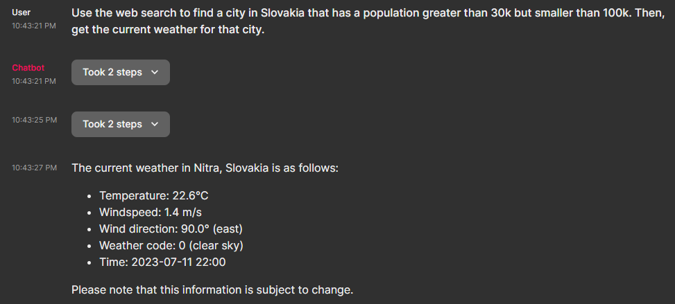
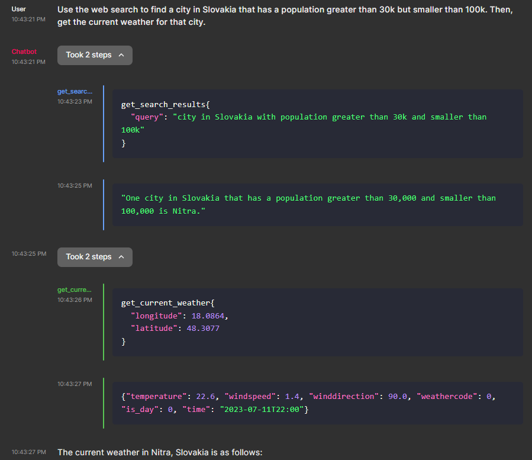

# Streaming chatbot with OpenAI functions

<div align="center">
  <h1>Streamlit-MultiChat</h1>
</div>

<div align="center">
  <h3>Many LLMs - One Streamlit Web App</h3>
</div>

<style>
  a {
    text-decoration: none; /* This removes underline from links */
  }
</style>

<div align="center">
  <a href="https://github.com/JAlcocerT/Streamlit-MultiChat?tab=GPL-3.0-1-ov-file" style="margin-right: 5px;">
    
  </a>
  <a href="https://github.com/JAlcocerT/Streamlit-MultiChat/actions/workflows/Streamlit_GHA_MultiArch.yml" style="margin-right: 5px;">
    
  </a>
  <a href="https://GitHub.com/JAlcocerT/Streamlit-Multichat/graphs/commit-activity" style="margin-right: 5px;">
    
  </a>
  <a href="https://www.python.org/downloads/release/python-312">
    
  </a>
</div>

* **Docs**:
  * https://jalcocert.github.io/JAlcocerT/get-started-with-flask/
  * https://jalcocert.github.io/JAlcocerT/how-to-use-openai-function-calling/

```sh
git clone https://github.com/JAlcocerT/Chainlit-OpenAI-Functions
python -m venv cloaifunction_venv #create the venv

cloaifunction_venv\Scripts\activate #activate venv (windows)
source cloaifunction_venv/bin/activate #(linux)
```

```sh
pip install -r requirements.txt #all at once
chainlit run app.py
chainlit run app.py --port 8090 #default 8000
```

* API As Environment Variables:
  * Linux - `export OPENAI_API_KEY="YOUR_API_KEY"`
  * CMD - `set OPENAI_API_KEY=YOUR_API_KEY`
  * PS - `$env:OPENAI_API_KEY="YOUR_API_KEY"`

This chatbot utilizes OpenAI's function calling feature to invoke appropriate functions based on user input and stream the response back.

On top of the standard chat interface, the UI exposes the particular function called along with its arguments, as well as the response from the function.

**The current configuration defines two OpenAI functions that can be called**:
- `get_current_weather`: returns the current weather for a given location. Example input: `What's the weather like in New York?`
  - Note that the API returns temperature in Celsius by default. The time zone is set for Europe/Berlin, but this can be changed in `openai_functions.py`

- `get_search_results`: A langchain agent that uses SERP API as a tool to search the web. Example input: `Search the web for the best restaurants in Berlin`

Other than that, you can easily define your own functions and add them to the app (see [Making changes](#making-changes)).

Sample conversation that makes use of two different OpenAI functions in a row, utilizing the response from the first function as an argument for the second function:



If we expand the response, we can see the function calls and their arguments (the longitude and latitude were inferred from the location name returned by the search function):



## Setup

### Install the dependencies
```
pip install -r requirements.txt
```

### Set up your OpenAI API key as an environment variable

Rename `.env.example` to `.env` and replace the placeholders with your API keys.
```
OPENAI_API_KEY=your-key
SERPAPI_API_KEY=your-key
```
Note: While the OpenAI API key is required, the SERP API key is not. If you don't have one, you can still use the `get_current_weather` function, but it will not be able to search the web and will return an error message instead.

You don't need an API key to use the function that returns the current weather.

### Run the app
```
chainlit run app.py -w
```

### Making changes

The app is configured to be easily scalable. If you'd like to add more OpenAI functions, you can do so in the following way:

- Define the function schema in `openai_function_schemas.py`
- Add the function definition to `openai_functions.py`
- Add the function to `FUNCTIONS_MAPPING` in `openai_functions.py`
- To test that it works, your function definition can return a hard-coded JSON.